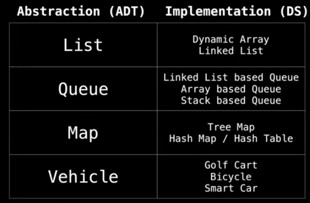

# Data Structures Easy to Advanced Course - Full Tutorial from a Google Engineer
[Youtube Videos](https://www.youtube.com/watch?v=RBSGKlAvoiM&ab_channel=freeCodeCamp.org)

## Introduction
* What is a Data Structure?
A **data structure** is a way of organizing data so that it can be used effectively.

They are essential ingredients in creating fast and powerful algorithms.
They help to manage and organize data.
They make code cleaner and easier to understand.

## Abstract Data Types vs. Data Structures

### Abstract Data Type
An **abstract data type** is an abstraction of a data structure which provides only the interface to which a data structure must adhere to.

The interface does note give any specific details about how somethin should be implemented or in what programming language.

## Computational Complexity Analisys

How much **time** does this algorithm need to finish?
How much **space** does this algorith need for its comoutation?

### Big-O Notation

*n: input size*

Constant Time: O(1)
Logarithmic Time: O(log(n))
Linear Time: O(n)
Linearithmic Time: O(nlog(n))
Quadric Time: O(n²)
Cubic Time: O(n³)
Exponential Time: O(b^n), b > 1
Factorial Time: O(n!)

## Static and Dynamic Arrays

### Static Array
A static array is a fixed length container containing n elements **indexable** from the range [0, n-1].

When and where is a static Array used?
1. Storing and acesing sequential data;
2. Temporarily storing objects
3. Used by IO routines and buffers
4. Lookup tables and inverse lookup tables
5. Can be used to return multiple values from a function
6. Used in dynamic programming to cache answers to subproblems 

### Dynamic Array
The dynamic array can **grow** and **shrink** in size.

1. Create a static array with an inicital capacity;
2. Add elements to the underlying static array, keeping track of the number of elements;
3. If adding another element will exceed the capacity, then create a new static array with twice the capacity and copy the original elements into it.

### Complexity:

## Singly and Doubly Linked Lists

### Linked list

A **linked list** is a sequential list of nodes that hold data which point to other nodes also containing data.

* Terminology:
    * Head: The first node;
    * Tail: The last node;
    * Pointer: Reference to another node;
    * Node: An object containing data and pointer(s)

### Singly linked list vs. Doubly linked list
Singly linked list only hold a reference to the next node.
Doubly linked list hold a reference to the next and previous node.

#### Pros and Cons
| | Pros | Cons |
| --- | --- | ---
| Singly linked | Uses less memory / Simpler implementation | Cannot easilyacess previous elements
| Doubly linked | Can be traversed backwards | Takes 2x memory

#### Complexity

| | Singly Linked | Doubly linked |
| --- | --- | --- |
| Search | O(n) | O(n) |
| Insert at head | O(1) | O(1) |
| Insert at tail | O(1) | O(1) |
| Remove at head | O(1) | O(1) |
| Remove at tail | O(n) | O(1) |
| Remove in middle | O(n) | O(n) |

## Stack

Is a one-ended linear data structure which moels a real world stack by having two primary operations, namely **push** and **pop**.

### Complexity

| --- | --- |
| Pushing | O(1) |
| Popping | O(1) | 
| Peeking | O(1) |
| Searching | O(n) |
| Size | O(1) |

## Queues

A queue is a linear data structure which models real world queues by having two primary operations, namely **enqueue** and **dequeue**.

**Enqueue:** put element in the back of the queue
**Dequeue:** remove the element of the front of the queue

 ### Complexity

 | --- | --- |
 | Enqueue | O(1) |
 | Dequeue | O(1) |
 | Peeking | O(1) |
 | Contains | O(n) |
 | Removal | O(n) |
 | Is Empty | O(1) |

## Priority Queues

A priority queue is an Abstract Data Type that operates similar to a normal queue except that **each elemnte has a certain priority**. The priority of the elements in the priority queue determine the order in which elements are removed from the PQ.

Priority queues only supports **comparable data**, meaning the data inserted into the priority queue must be able to be ordered in some way either from least to greatest or greatest to least. This os so that we are able to assing relative priorities to each element.

Priority queues are usually implemented with **heaps** since this gives them the best possible time comlexity.

### Complexity

--- | --- 
Binary Heap constuction | O(n)
Polling | O(log(n))
Peeking | O(1)
Adding | O(log(n))
Naive Removing | O(n)
Advanced removing with help from a hash table* | O(n)
Naive contains | O(n)
Contains check with with help of a hash table* | O(1)

## Heaps

A heap is a **tree** based data structure that satisfies the **heap invariant** (heap property): If A is a parent node of B  then A is ordered with respect to B for all nodes A, B in the heap.

There are many types of heaps:
1. Binary Heap
2. Fibonacci Heap
3. Binomial Heap
4. Pairing Heap
...

## Union Find

**Union Find** is a data structure that keeps track of elements which are split nto one or more disjoint sets. Its has two primary operations: *find* and *union*.

### When and where is a Union Find used?
* Kruskal's minimum spanning tree algorithm
* Grid percolation
* Network connectivity
* Least common ancestor in tress
* Image processing

### Complexity
|   |   |
--- | --- 
Contruction | O(n)
Union |  α(n)
Find |  α(n)
Get component size |  α(n)
Check if connected |  α(n)
Count components |  O(1)

> α(n) - Amortized constant time

### Union Find application: Kruskal's Minimum Spanning Tree Algorithm

Givem a graph G = (V, E) we want to find a **Minimum Spanning Tree** in the graph (it may not be unique).

A minimum spannig tree is a subset of the edges which connect all vertices in the graph with the minial total edge cost.

1. Sort edges by ascending edge weight.
2. Walk through the sorted edges and look at the two nodes the edge belongs to, if the nodes are already unified we don`'t include this edge, otherwise we include it an unify the nodes.
3. The algorithm terminates when every edge has been processed or all the vertices have been unified.

### Creating Union Find

To begin using Union Find, first construct a **bijection** (a mapping) between your objects and the integers in the range [0, n].

NOTE: This step is note necessary in general, but it will allow us to construct an array-based union find.

 #### Find Operation

 To **find** which component a particular element belongs to find the root of that component by following the parent nodes until a self loop is reached (a node who's parent is itself).

 ### Union operation

 To **unify** two elements find which are the root nodes of each component and if the root nodes are different make one of the root nodes be the parent of the other.

### Path Compression Union Find

We make every node point to the root node.

## Binary Trees and Binary Search Trees

A **tree** is an **undirected graph** which satisfies any of the following definitions:
    * An acyclic connected graph;
    * A connected graph with N nodes and N-1 edges;
    * An graph in which any two vertices are connected by exactly one path.

**Root node**: root of the tree
**Child**: is a node extending from another node
**Parent**: is the inverse of a child node
**Leaf node**: is a node with no children
**Subtree**: is a tree entirely contained within another

### Binary tree

A **binary tree** is a tree for wich every node has at most two child nodes

#### When and where are Binary Trees used?

* Binary Search Trees:
    * Implementation of some map and set ADTs
    * Red Black Trees
    * AVL Trees
    * Splay Tress
    * etc
* Used in the implementation of binary heaps
* Syntax trees (used by compiler and calculators)
* Treap - a probabilistic DS (uses a randomized BST)

### Binary search tree 

A **binary search tree** is a binary tree that satisfies the **BST invariant**: left subtree has smaller elements and right subtree has larger elements.

#### Complexity

| Operation | Average | Worst |
| --- | --- | --- |
| Insert | O(log(n)) | O(n) |
| Delete | O(log(n)) | O(n) |
| Remove | O(log(n)) | O(n) |
| Search | O(log(n)) | O(n) |

## Hash tables

A **Hash table** is a data structure that provides a mapping from keys to values using a technique called **hashing**.

### Hash function

A **hash function** H(x) is a function that maps a key 'x' to a whole number in a fixed range.

#### Properties of Hash functions

1. If **H(x) = H(y)**, then objects x and y might be equal, but if **H(x) <> H(y)** then x and y are **certainly not equal**;
2. A hash function H(x) must be **deterministic**;
3. We try to ma make **uniform** hash functions to minimize the number of hash collisions;
4. A **hash colision** is when two objects x, y hash to the same value

#### How to handle hash collisions

**Separate chaining** deals with hash collisions by maintaining a data structure (usually a linked list) to hold all the different values which hashed to a paticular value.

**Open addressing** deals with hash collisions by finding another place within the hash table for the object to go by offsetting it from the position to which it hashed to.

### Complexity

| Operation | Average | Worst |
| --- | --- | --- |
| **Insertion** | O(1) | O(n) |
| **Removal** | O(1) | O(n) |
| **Search** | O(1) | O(n) |

### Hash table Separate chaining

**Separate chaining** is one of many strategies to deal with hash collisions by maintaining a data structure (usually a linked list) to hold all the different values which hashed to a particular value.

### Hash table open addressing

Main idea: if the position our key hashed to is occupied we try another position in the hash table by offsetting the current position subject to a **probing sequence P(x)**. We keep doing this until an unoccupied slot is found.

There are an infinite amount of probing sequences:
* Linear probing: probes according to a linear formula P(x) = ax + b;
* Quadratic probing: probes according to a quadratic formula;
* Double hashing: probes according to a constant multiple of another hash function;
* Pseudo random number generator.

